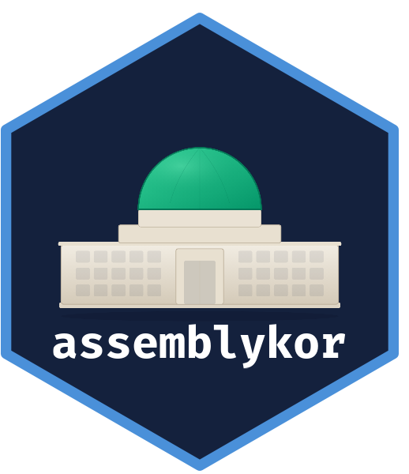

# assemblykor 

<!-- badges: start -->
[](https://github.com/kyusik-yang/assemblykor/actions/workflows/R-CMD-check.yaml)
<!-- badges: end -->

Korean National Assembly data for political science education.

**Documentation**: <https://kyusik-yang.github.io/assemblykor/>

## Overview

The goal of `assemblykor` is to provide a curated collection of Korean
National Assembly datasets for teaching quantitative methods in political
science. Think of it as a Korean politics counterpart to
[palmerpenguins](https://allisonhorst.github.io/palmerpenguins/).

The package includes seven built-in datasets covering legislators, bills,
asset declarations, policy seminars, committee speeches, plenary votes,
and roll call records, all drawn from public data of the Korean National
Assembly (2000-2026).

## Why tidyverse?

This package and all its tutorials follow
[tidyverse](https://tidyverse.org/) conventions. We use `dplyr`,
`ggplot2`, `tidyr`, and the pipe operator (`%>%`) throughout.

Why tidyverse-first for teaching?

- **Readability**: tidyverse syntax reads like a sequence of data
  operations, reducing cognitive load for beginners
  ([Cetinkaya-Rundel et al., 2022](https://arxiv.org/abs/2108.03510)).
- **Consistency**: Packages share a common grammar and data structure,
  so learning one makes the next easier
  ([Wickham et al., 2019](https://doi.org/10.21105/joss.01686)).
- **Doing things quickly**: Students can perform meaningful data analysis
  from day one, rather than spending weeks on base R syntax
  ([Robinson, 2017](http://varianceexplained.org/r/teach-tidyverse/)).
- **Community standard**: Most modern R textbooks, including
  [R for Data Science](https://r4ds.hadley.nz/), adopt tidyverse as the
  default, making it easier for students to find help and resources.

> **Note**: This package is designed for educational purposes only.
> The datasets have been processed and curated for classroom use and may
> not reflect the most up-to-date or complete records. For research or
> policy analysis, please verify against the original data sources listed
> in the [Data sources](#data-sources) section below.

## Meet the data

<table>
<tr><td width="50%">

**`legislators`** 947 records

20-22대 국회의원 메타데이터 (이름, 정당, 선거구, 성별, 선수, 발의 건수)

</td><td width="50%">

**`bills`** 60,925 records

법안 메타데이터 (제목, 위원회, 발의일, 처리 결과, 대표발의자)

</td></tr>
<tr><td>

**`wealth`** 2,928 records

의원 재산신고 패널 (순자산, 부동산, 예금, 주식, 13개 시점)

</td><td>

**`seminars`** 5,962 records

정책세미나 활동 패널 (개최 건수, 초당적 비율, 여당 여부)

</td></tr>
<tr><td>

**`speeches`** 15,843 records

22대 과학기술정보방송통신위원회 상임위 회의록 전수 (발언 전문, 화자 역할 포함)

</td><td>

**`votes`** 7,997 records

본회의 표결 결과 (20-22대, 찬성/반대/기권 수, 의결 결과)

</td></tr>
<tr><td colspan="2">

**`roll_calls`** 368,210 records

22대 개별 의원 표결 기록 (의원별 찬성/반대/기권/불참, 1,233개 법안)

</td></tr>
</table>

## Installation

```r
# install.packages("remotes")
remotes::install_github("kyusik-yang/assemblykor")
```

## Usage

```r
library(assemblykor)

data(legislators)
data(bills)
data(wealth)
data(seminars)
data(speeches)
data(votes)
data(roll_calls)
```

### Example: party composition by gender

```r
library(dplyr)

legislators %>%
  filter(assembly == 22) %>%
  count(party, gender) %>%
  filter(n >= 3)
```

### Example: wealth distribution

```r
library(ggplot2)

ggplot(wealth, aes(x = net_worth / 1e6)) +
  geom_histogram(bins = 50, fill = "steelblue") +
  labs(x = "Net worth (billion KRW)", y = "Count",
       title = "Distribution of legislator wealth")
```

### Example: bill outcomes

```r
bills %>%
  count(result, sort = TRUE) %>%
  head(5)
#>               result     n
#> 1     임기만료폐기 30678
#> 2     대안반영폐기 13692
#> 3         수정가결  2222
#> 4         원안가결  1048
#> 5             철회   578
```

## Korean font setup

ggplot2 plots with Korean text (axis labels, titles) may show broken
characters. Run this once per session to fix it:

```r
set_ko_font()
#> Korean font set: Apple SD Gothic Neo
```

This auto-detects a Korean font on your system (macOS, Windows, Linux).
The interactive tutorials (`run_tutorial()`) handle this automatically.

## Downloadable datasets

Larger datasets are available via download functions (requires the `arrow`
package):

```r
# Bill propose-reason texts (60,925 texts, ~40 MB download)
texts <- get_bill_texts()

# Co-sponsorship records (769,773 rows, ~25 MB download)
proposers <- get_proposers()
```

## Tutorials (한국어 수업 자료)

The package includes nine Korean-language tutorials designed for classroom
use in political science methods courses:

| # | Tutorial | Topic | Level |
|---|----------|-------|-------|
| 1 | R 기초와 tidyverse | `dplyr` 핵심 함수, 파이프, 데이터 결합 | Beginner |
| 2 | ggplot2 시각화 | 막대, 히스토그램, 산점도, 박스플롯, facet | Beginner |
| 3 | 회귀분석 | OLS, 다중회귀, 로그 변환, 상호작용, 계수 시각화 | Intermediate |
| 4 | 패널 데이터와 고정효과 | 합동 OLS vs FE, 양방향 FE, DiD, 군집 표준오차 | Intermediate |
| 5 | 텍스트 분석 입문 | 키워드 빈도, TF-IDF, 발언 분석, 위원회별 비교 | Intermediate |
| 6 | 네트워크 분석 | 공동발의 네트워크, 중심성, 커뮤니티 탐지, 초당적 분석 | Advanced |
| 7 | 기명투표 분석 | Rice Index, 이탈투표, 투표 히트맵, 정당 응집력 | Advanced |
| 8 | 법안 가결 요인 | 이항 변수, 로지스틱 회귀, 승산비, 예측 확률 | Intermediate |
| 9 | 발언 패턴 분석 | 발언 빈도/길이, 발언 순서, 의제 키워드, 다양성 | Advanced |

Each tutorial is available in two formats:

**Option A: Interactive browser** (recommended for self-study)

```r
# Launch an interactive tutorial with exercises in the browser
run_tutorial(1)  # or run_tutorial("01-tidyverse-basics")
```

Requires the `learnr` package (`install.packages("learnr")`). Students can
type and run code directly in the browser with hints and solutions.

**Option B: Plain R Markdown** (for editing in RStudio)

```r
# List available tutorials
list_tutorials()

# Copy an Rmd file to your working directory
open_tutorial(1)  # or open_tutorial("01-tidyverse-basics")
```

Students can edit and knit the Rmd file in RStudio at their own pace.

## Joining datasets

All datasets share the `member_id` and/or `assembly` columns for easy
joining:

```r
# Merge legislators with wealth data
leg_wealth <- legislators %>%
  inner_join(wealth, by = "member_id", relationship = "many-to-many")
```

## CSV access

CSV versions of the smaller datasets are available for teaching file I/O:

```r
# Find the file path
path_to_file("legislators.csv")

# Read directly
legislators_csv <- read.csv(path_to_file("legislators.csv"), fileEncoding = "UTF-8")
```

## Data sources

All data in this package are derived from publicly available sources.

| Dataset | Source | License |
|---------|--------|---------|
| Legislators, bills, proposers, votes, roll calls | Open National Assembly API (<https://open.assembly.go.kr>) | Public domain (Korean government open data) |
| Speeches (committee minutes) | [speech-assembly-korea](https://github.com/kyusik-yang/speech-assembly-korea) | Public domain |
| Asset declarations | [OpenWatch](https://docs.openwatch.kr/data/national-assembly) | CC BY-SA 4.0 |
| Policy seminars | National Assembly Seminar Database | Public data |

**Inspired by**: [palmerpenguins](https://allisonhorst.github.io/palmerpenguins/)
(Horst, Hill & Gorman, 2020), which demonstrates how domain-specific
datasets can make methods teaching more engaging.

## Disclaimer

This package is intended **for educational use only** (teaching
quantitative methods in political science courses). The datasets have
been processed, filtered, and in some cases sampled for classroom
convenience. They should not be treated as authoritative records.

For research or policy analysis, please consult the original data sources
listed above and verify the data independently.

## Citation

```r
citation("assemblykor")
```

```
Yang, Kyusik (2026). assemblykor: Korean National Assembly Data for
Political Science Education. R package version 0.1.0.
https://github.com/kyusik-yang/assemblykor
```

## License

MIT (package code). Data licenses as noted above.
