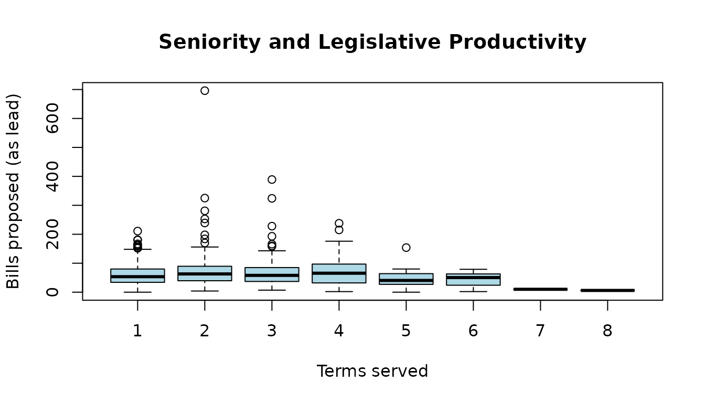
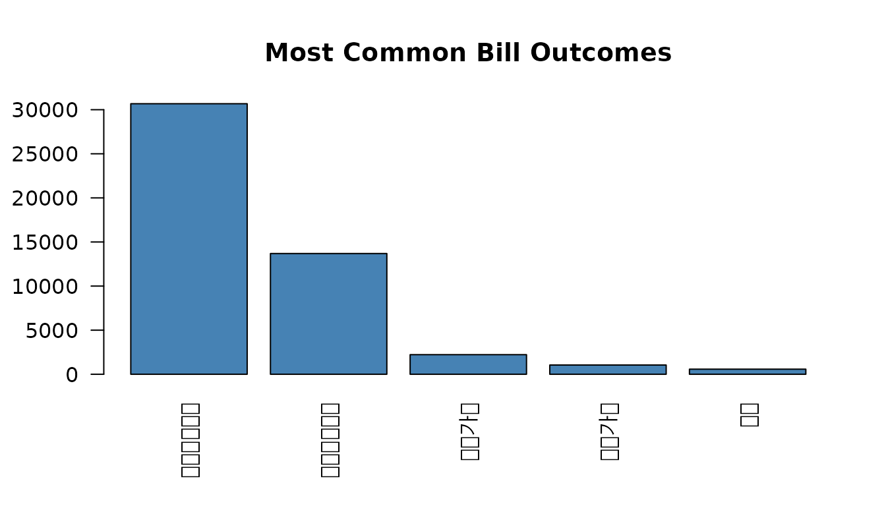
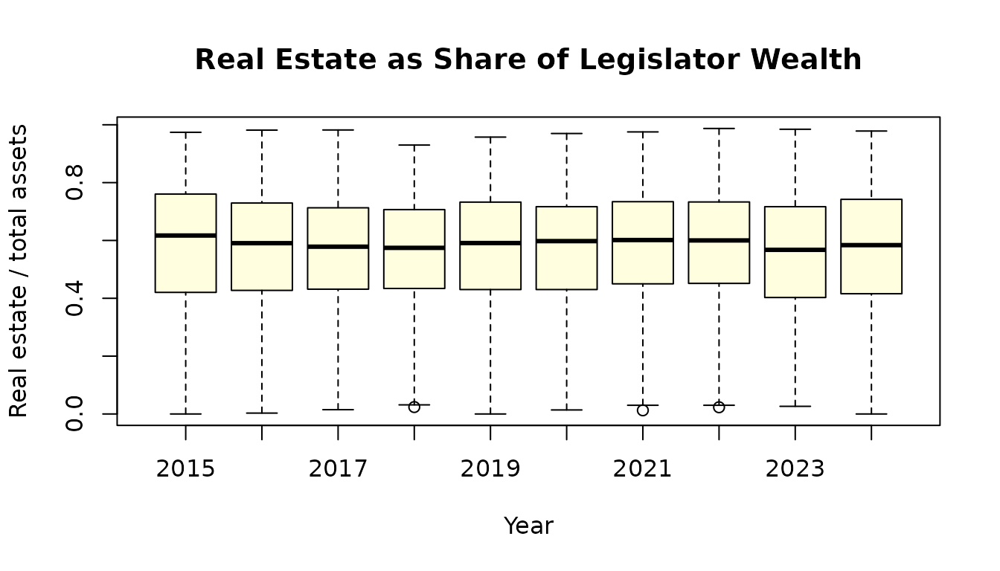
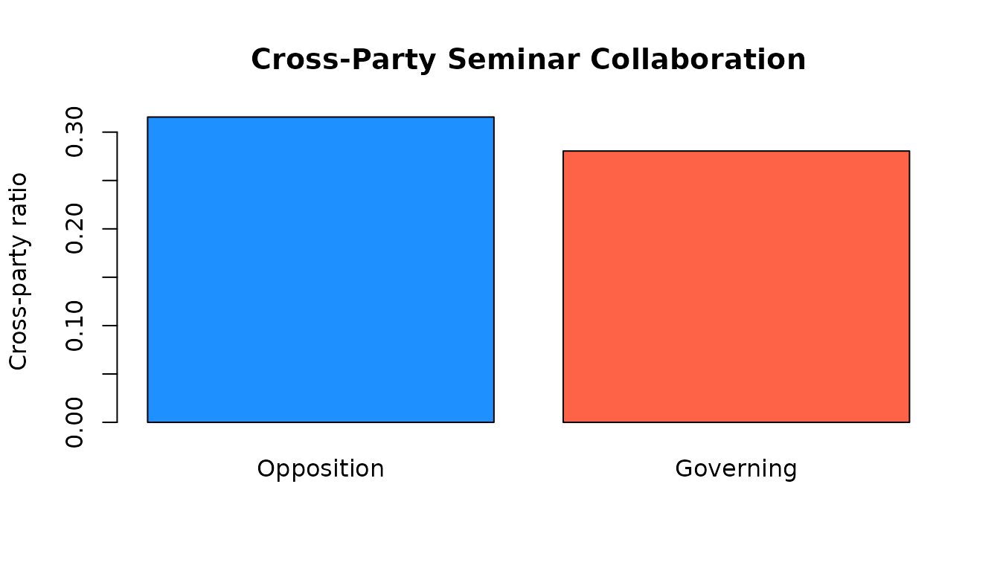
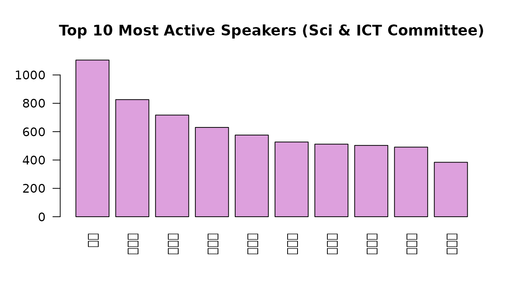

# Getting Started with assemblykor

## Overview

`assemblykor` provides seven built-in datasets from the Korean National
Assembly for teaching quantitative methods in political science:

- **`legislators`**: 947 MP records (20th-22nd assemblies)
- **`bills`**: 60,925 legislative bills
- **`wealth`**: 2,928 legislator-year asset declarations
- **`seminars`**: 5,962 legislator-year seminar activity records
- **`speeches`**: 15,843 committee speech records (22nd, Science & ICT)
- **`votes`**: 7,997 plenary vote tallies (20th-22nd)
- **`roll_calls`**: 368,210 member-level roll call votes (22nd)

``` r
library(assemblykor)
#> 
#>   ┌───────────────────────────────────────────────────────────────┐
#>   │ assemblykor 0.1.0                                             │
#>   │ Korean National Assembly Data for Political Science Education │
#>   └───────────────────────────────────────────────────────────────┘
#> 
#>   7 built-in datasets:
#>     legislators    947 recs   MPs (20-22nd)
#>     bills       60,925 recs   Bills proposed
#>     wealth       2,928 recs   Asset declarations
#>     seminars     5,962 recs   Policy seminars
#>     speeches    15,843 recs   Committee speeches (22nd, Sci & ICT)
#>     votes        7,997 recs   Plenary vote tallies
#>     roll_calls 368,210 recs   Member-level votes (22nd)
#> 
#>   Downloadable:
#>     get_bill_texts()           Bill propose-reason texts
#>     get_proposers()            Co-sponsorship records
#> 
#>   Tutorials:
#>     list_tutorials()           See all 9 tutorials
#>     run_tutorial(1)            Launch in browser (interactive)
#>     open_tutorial(1)           Copy Rmd to working directory
#> 
#>   Korean font for ggplot2:     set_ko_font()
#> 
#>   https://github.com/kyusik-yang/assemblykor
```

## 1. Exploring legislator data

``` r
data(legislators)
str(legislators)
#> 'data.frame':    947 obs. of  15 variables:
#>  $ member_id    : chr  "XQ98168F" "60490713" "IH436704" "8I61593E" ...
#>  $ assembly     : int  20 20 20 20 20 20 20 20 20 20 ...
#>  $ name         : chr  "강길부" "강병원" "강석진" "강석호" ...
#>  $ name_hanja   : chr  "姜吉夫" "姜炳遠" "姜錫振" "姜碩鎬" ...
#>  $ name_eng     : chr  "KANG GHILBOO" "KANG BYUNGWON" "KANG SEOGJIN" "KANG SEOKHO" ...
#>  $ party        : chr  "무소속" "더불어민주당" "자유한국당" "자유한국당" ...
#>  $ party_elected: chr  "무소속" "더불어민주당" "새누리당" "새누리당" ...
#>  $ district     : chr  "울산 울주군" "서울 은평구을" "경남 산청군함양군거창군합천군" "경북 영양군영덕군봉화군울진군" ...
#>  $ district_type: chr  "constituency" "constituency" "constituency" "constituency" ...
#>  $ committees   : chr  "산업통상자원중소벤처기업위원회, 4차 산업혁명 특별위원회, 예산결산특별위원회, 교육문화체육관광위원회" "" "농림축산식품해양수산위원회, 국회운영위원회, 보건복지위원회, 예산결산특별위원회" "농림축산식품해양수산위원회, 외교통일위원회, 정보위원회, 정치개혁 특별위원회, 행정안전위원회, 안전행정위원회" ...
#>  $ gender       : chr  "M" "M" "M" "M" ...
#>  $ birth_date   : Date, format: "1942-06-05" "1971-07-09" ...
#>  $ seniority    : int  4 2 1 3 4 1 3 2 2 1 ...
#>  $ n_bills      : int  312 1078 694 583 1131 393 1478 932 1284 1054 ...
#>  $ n_bills_lead : int  21 94 53 43 89 74 75 55 78 64 ...
```

### Gender composition by assembly

``` r
gender_tab <- table(legislators$assembly, legislators$gender)
gender_tab
#>     
#>        F   M
#>   20  53 267
#>   21  64 258
#>   22  64 241
prop.table(gender_tab, margin = 1)
#>     
#>              F         M
#>   20 0.1656250 0.8343750
#>   21 0.1987578 0.8012422
#>   22 0.2098361 0.7901639
```

### Legislative productivity by seniority

``` r
boxplot(n_bills_lead ~ seniority, data = legislators,
        xlab = "Terms served", ylab = "Bills proposed (as lead)",
        main = "Seniority and Legislative Productivity",
        col = "lightblue")
```



Senior legislators produce more bills, but with high variance.

## 2. Bill outcomes

``` r
data(bills)

# Top 5 outcomes
outcome_counts <- sort(table(bills$result), decreasing = TRUE)
barplot(outcome_counts[1:5], las = 2, col = "steelblue",
        main = "Most Common Bill Outcomes")
```



Most bills expire at the end of the assembly term (임기만료폐기). Only a
small fraction pass in their original form (원안가결).

### Bills per month

``` r
bills$month <- format(bills$propose_date, "%Y-%m")
monthly <- aggregate(bill_id ~ month, data = bills, FUN = length)
names(monthly) <- c("month", "count")
monthly <- monthly[order(monthly$month), ]

plot(seq_len(nrow(monthly)), monthly$count, type = "l",
     xlab = "Month (index)", ylab = "Bills proposed",
     main = "Monthly Bill Proposals (20th-22nd Assembly)")
```


## 3. Wealth panel

The `wealth` dataset is a legislator-year panel ideal for practicing
fixed-effects regression.

``` r
data(wealth)

# Distribution of net worth
hist(wealth$net_worth / 1e6, breaks = 50, col = "coral",
     main = "Legislator Net Worth Distribution",
     xlab = "Net Worth (billion KRW)")
```


### Real estate concentration

``` r
wealth$re_share <- ifelse(wealth$total_assets > 0,
                          wealth$real_estate / wealth$total_assets, NA)

boxplot(re_share ~ year, data = wealth,
        xlab = "Year", ylab = "Real estate / total assets",
        main = "Real Estate as Share of Legislator Wealth",
        col = "lightyellow")
```



Korean legislators hold a large share of their wealth in real estate,
reflecting broader patterns in Korean household wealth.

## 4. Policy seminars and cross-party cooperation

``` r
data(seminars)

# Governing vs opposition party
gov_means <- tapply(seminars$cross_party_ratio,
                    seminars$is_governing, mean, na.rm = TRUE)
barplot(gov_means, names.arg = c("Opposition", "Governing"),
        ylab = "Cross-party ratio", col = c("dodgerblue", "tomato"),
        main = "Cross-Party Seminar Collaboration")
```



Governing-party legislators tend to have lower cross-party collaboration
in policy seminars, a pattern consistent with the “closing ranks”
hypothesis.

## 5. Joining datasets

All datasets share the `member_id` and/or `assembly` columns:

``` r
library(dplyr)

# Merge legislators with wealth
leg_wealth <- legislators %>%
  inner_join(wealth, by = "member_id", relationship = "many-to-many")

# Productivity vs wealth
leg_wealth %>%
  group_by(district_type) %>%
  summarise(
    n = n(),
    median_net_worth = median(net_worth / 1e6, na.rm = TRUE),
    median_bills = median(n_bills_lead, na.rm = TRUE)
  )
#> # A tibble: 2 × 4
#>   district_type     n median_net_worth median_bills
#>   <chr>         <int>            <dbl>        <dbl>
#> 1 constituency   4489             1.48           62
#> 2 proportional    466             1.23           65
```

## 6. Plenary votes

``` r
data(votes)

# Yes-vote share distribution
votes$yes_rate <- votes$yes / votes$voted
hist(votes$yes_rate, breaks = 40, col = "lightgreen",
     main = "Distribution of Yes-Vote Share",
     xlab = "Proportion yes")
```


Most bills pass with near-unanimous support. The left tail reveals
contested legislation where party discipline breaks down.

## 7. Roll call analysis

``` r
data(roll_calls)
library(dplyr)

# Party discipline: how often do members vote with their party majority?
party_votes <- roll_calls %>%
  group_by(bill_id, party) %>%
  mutate(party_majority = names(which.max(table(vote)))) %>%
  ungroup() %>%
  mutate(with_party = vote == party_majority)

party_votes %>%
  group_by(party) %>%
  summarise(
    n_members = n_distinct(member_id),
    discipline = mean(with_party, na.rm = TRUE)
  ) %>%
  filter(n_members >= 5) %>%
  arrange(desc(discipline))
#> # A tibble: 11 × 3
#>    party        n_members discipline
#>    <chr>            <int>      <dbl>
#>  1 진보당               5      0.936
#>  2 조국혁신당          13      0.908
#>  3 정의당              14      0.815
#>  4 더불어민주당       291      0.792
#>  5 개혁신당             7      0.790
#>  6 민생당              21      0.732
#>  7 미래한국당          19      0.692
#>  8 무소속              32      0.681
#>  9 국민의힘           176      0.677
#> 10 미래통합당          54      0.676
#> 11 자유한국당          10      0.650
```

## 8. Speech patterns

``` r
data(speeches)

# Who speaks most in committee?
leg_speeches <- speeches[speeches$role == "legislator", ]
speaker_counts <- sort(table(leg_speeches$speaker_name), decreasing = TRUE)
barplot(speaker_counts[1:10], las = 2, col = "plum",
        main = "Top 10 Most Active Speakers (Sci & ICT Committee)")
```



## Next steps

For text analysis, download the bill propose-reason texts:

``` r
texts <- get_bill_texts()
```

For network analysis, download the full co-sponsorship records:

``` r
proposers <- get_proposers()
```

See
[`vignette("codebook")`](https://kyusik-yang.github.io/assemblykor/articles/codebook.md)
for the full data dictionary, or
[`?get_bill_texts`](https://kyusik-yang.github.io/assemblykor/reference/get_bill_texts.md)
and
[`?get_proposers`](https://kyusik-yang.github.io/assemblykor/reference/get_proposers.md)
for download function details.
